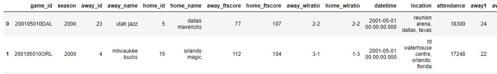

# NBA Odds Prediction

## About

The objective is to **predict the odds of winning the 2018/2019 NBA championship**, for all 30 teams.

More precisely, given a specific dataset, there are 2 tasks:
* Predict the championship odds before the start of the 2018/2019 *regular season*
* Predict the championship odds before the start of the 2018/2019 *playoffs*

## Instructions

This application offers a single entry point, named `main.py`, located at the root of the `src` subfolder. Among features available for this script:

- Usage of a YAML file with all experiment parameters (more practical not to have to enter a lot of parameters from the command line). This config file is located in the `conf\` subfolder.
- Logging of execution traces, by default in the `logs\` subfolder.
- Setting of the randomness via a seed in the config file, for reproducibility purposes.

There are **4 availables modes** : 
* "prepare": Build the preprocessed dataset from raw data.
* "train": Train a ML model on the preprocessed dataset.
* "before_regular": Predict odds using the trained model and data from before the 2018/2019 regular season.
* "before_playoffs": Predict odds using the trained model and data from before the 2018/2019 playoffs.

You are expected to run these 4 modes in succession (the last 2 modes for examples require both the preprocessed dataset and the trained model). The requested mode can be set in the config file `conf\conf.yml`.

Usage: *python .\src\main.py*

With the root folder of this project as your working directory, this will run the `main.py` script using the `conf\conf.yml` file for experiment parameters. 

The provided dataset is located in the `data\raw\` subfolder. There are 2 files: 
* `123a16617d2449b9806ca11a2f2749a9.snappy.parquet`: game-level data
* `ef2db37a045d4c3eaed35507f880e820.snappy.parquet`: player-level data

First rows and columns of game-level data:

First rows and columns of player-level data:

### ---prepare---

The "prepare" mode objective is to transform the raw data into a preprocessed dataframe which will be used in other modes. The preprocessed dataframe will be saved on disk as `data\preprocessed\all_seasons.csv`.

### ---train---

The "train" mode objective is to train a model on the preprocessed data. The resulting artifact is a ML model saved on disk in the `models\` subfolder, which will subsequently be used in the "before_regular" and "before_playoffs" modes.

### ---before_regular---

The "before_regular" mode objective is to predict odds for the 2018/2019 championship for all 30 teams, being allowed to use data from before the start of the 2018/2019 regular season. The odds are predicted in the decimal format and saved in the `odds\` subfolder as a CSV file.

### ---before_playoffs---

Same as "before_regular", but being allowed to use data from the 2018/2019 regular season as well.

## Structure

Here is how this application is structured:

- `conf`: location of the YAML configuration file.
- `data`: 
    - `plots`: location of the plots generated during an execution of the script in "train" mode. It includes a "features importance" plot and a "prediction vs ground truth" plot
    - `processed`: location of the preprocessed data in CSV format, resulting from an execution of the script in "prepare" mode.
    - `raw`: location of the 2 raw data files (game-level and player-level)
    - `readme`: location of the images illustrating this README.md file
- `logs`: location of the log files which are saved for each execution of the script, no matter the mode.
- `models`: location of the saved ML model resulting from an execution of the script in "train" mode.
- `odds`: location of the CSV files containing predicted championship odds, resulting from an execution of the script in either "before_regular" or "before_playoffs" mode.
- `presentation`: location of a PPT presentation with information about the choices, some analysis of the results and improvements suggestions.
- `src`:
    - `execution`: location of the domain-related code
    - `utils`: location of "utility" code, not necessarily related to the domain at hand

## Framing the Problem

To predict a NBA season, there are generally 3 granularity levels to consider.

* Team-level stats: aggregate stats over a season at the team level. It is the simplest way of the 3, it doesn't require to know the composition of the roster day-to-day. It also gives the worst predictions out of the 3 methods.
* Player-level stats: simulate each game based on the roster composition for the 2 teams in each game. Allows to take into account factors that are not available in game-level stats (key players injured for example).
* Possession-level stats: simulate each game on the possession level. Requires predicting the number of possessions in a game, who is on the floor for each possession (so predicting substitution patterns), expected output of each possession.

Obviously, the finer-grained the data is, the better results one could expect (but also the more difficult the modeling is).

With the data at our disposal here, there is one major issue: we don't have *any* information about player movement in the 2018 offseason, such as trades, free agent signings, retirements, season-altering injuries. So if we were to try to model at the player level, we would be modeling the 2018/2019 season with team rosters dating from the previous season. Mainly for this reason (and also considering the time that was available for this project), it was decided to **model at the team level only**.

With that choice in mind, one quick look at the available game-level data shows that we have the necessary features to model this prediction task using the renowned **[Four Factors](http://www.rawbw.com/~deano/articles/20040601_roboscout.htm)** methodology. This methodology, introduced by [Dean Oliver](https://en.wikipedia.org/wiki/Dean_Oliver_(statistician)) in 2002, posits that the combination of four team-level stats allows for fairly accurate predictions in terms of winning a basketball game at the NBA level. In accordance with [this follow-up article](https://squared2020.com/2017/09/05/introduction-to-olivers-four-factors/#:~:text=Four%20Factors%3A%20Score%2C%20Protect%2C,line%20as%20often%20as%20possible.) from [Justin Jacobs](https://en.wikipedia.org/wiki/Justin_Jacobs), we chose here to also model the opponent's four factors.

A personal choice was made to not use the raw data for these factors, but to use the deviation compared to the mean for that season. Play styles evolve over time in the NBA (pace and 3-pts/game are up a lot today compared to 20 years ago for example). Since we intend to fit a model over almost two decades of play, we might learn wrong signals when using the raw numbers and comparing teams' factors vs each other in the same season makes more sense.

We end up with the following variables:
* wins, losses, pts_diff
* efg_vs_avg, opp_efg_vs_avg
* tov_vs_avg, opp_tov_vs_avg
* orb_vs_avg, opp_orb_vs_avg
* ftfga_vs_avg, opp_ftfga_vs_avg
* ortg_vs_avg, opp_ortg_vs_avg
* pace_vs_avg
* attendance

In addition to the original four factors, we kept the pace and the offensive rating which were provided in the dataset, along with the attendance (regular bigger crowds might correlate with winning).

A predictive model needs a **target**, one that correlates as much as possible with the original objective, which is delivering odds of winning the 2018/2019 NBA championship. One possibility could be to assign for each season "1" for the winner and "0" for the other teams, but that wouldn't help much: the finalist would have the same target value as the worst team in the league. The target which was ultimately chosen is **the number of playoff wins**. It seems like a decent proxy for evaluatin which teams in a given season were the closest to winning a championship

First rows of the preprocessed dataset:

Ultimately, with this methodology we ended up with some very high odds for the very worst teams. In real sports life, black swan events happen every once in a while (Leicester winning the Premier League in 2015/2016), and a bookmaker needs to cap the odds it offers on these potential black swan events, to ensure keeping financial stability. For this reason, in this project, the worst odds were capped at 300, which means any teams that had predicted odds higher than 300 saw its odds reduced to precisely 300.

## Technical Choices

- In terms of **performance metrics**, the chosen metric here is RMSE (root squared mean error). It's a fairly common metric for regression tasks, along with others like MAE (mean absolute error) or MAPE (mean absolute percentage error) which would also make a lot of sense here as well. RMSE tends to penalize big errors more, and you want to avoid outsized errors when preparing gambling odds.

- The algorithm chosen to treat this problem is **gradient boosted trees** , via the **LightGBM** implementation. Several algorithms were benchmarked, among which linear regression (via the Ridge regressor implementation), or tree-based algorithms like Extra-Trees or Random Forests. But as is very often the case with tabular data, gradient boosted trees tend to perform better than the other mentioned possibilities, especially when the number of features gets larger. As for the implementation, LightGBM was chosen instead of XGBoost, as it is usually faster. CatBoost could have been another option.

- Some of the most important hyper-parameters of the algorithm have been tuned using successive iterations of **Bayesian Optimization**, each time restricting the ranges of the most impactful variables. I used the [BayesianOptimization](https://github.com/fmfn/BayesianOptimization) package. A recent version of the code used for this is available as a notebook: `notebooks\NBA_Optim.ipynb`.

- For cross-validation, a standard K-Fold method is used with 5 folds, without any temporality taken into account. The reason is, this is not a traditional forecast task, in the sense that the goal is not to predict the upcoming values of a time series, at least that is not the way the problem is framed here. The preprocessed dataframe has each row independent of each other (each row represents aggregated stats over a given full regular season for a given team).

## Performance

Using a 5-fold cross-validation scheme, we end up with an **out-of-fold average RMSE** across the seasons 2000/2001 to 2017/2018 equal to about **7 playoff wins**. That is obviously fairly terrible! This wasn't unexpected though, considering we used low-granularity data and had limited time to devote to this project. 

Here is the plot of projected vs actual playoff wins for all teams in seasons 2000/2001 to 2017/2018:

It's easy to see that the model never predicts any team above 12 wins, once again not unexpected, as ML models tend to struggle to predict correctly the extremes of outcome distributions. Better modeling or some post-processing might give some low-hanging improvements there.

It could without a doubt be much improved with more time, and more data, as it doesn't seem great. Looking at a plot of predictions vs ground truth below, we can see the model is really bad for predictions of high-priced items, mostly under-predicting. 

Looking at the features importance plot, it's clear that the wins, losses and point-differential variables are the ones with the biggest predictive power. This is also not surprising, as the four factors original purpose is to be representative of what is important to win basketball games, not to predict the outcome of future games.

